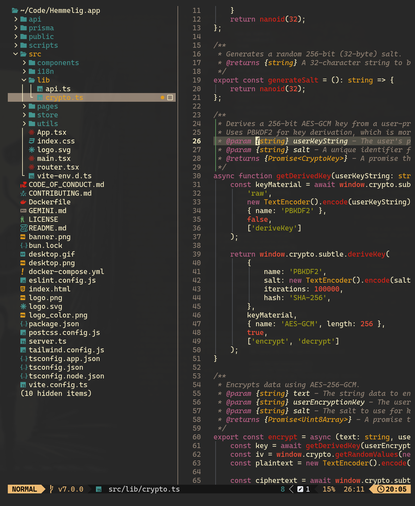

# Aether.nvim

A dark Neovim colorscheme with WCAG accessible contrast ratios, direct color injection, and broad plugin support.

> **Branch note:** This is the `v3` branch. Use `branch = "v3"` in your plugin manager.



## Requirements

Neovim 0.8 or later with true color support enabled:

```lua
vim.opt.termguicolors = true
```

## Install

### lazy.nvim

```lua
{
    "bjarneo/aether.nvim",
    branch = "v3",
    priority = 1000,
    config = function()
        require("aether").setup()
        vim.cmd.colorscheme("aether")
    end,
}
```

### With custom colors

Every palette color is a named variable you can override directly. Pass any combination through the `colors` table.

```lua
{
    "bjarneo/aether.nvim",
    branch = "v3",
    name = "aether",
    priority = 1000,
    opts = {
        colors = {
            bg         = "#1a1d24",
            dark_bg    = "#13161c",
            darker_bg  = "#0e1015",
            lighter_bg = "#242830",

            fg         = "#a2aebb",
            dark_fg    = "#6b7688",
            light_fg   = "#c0ccd5",
            bright_fg  = "#dfe6eb",
            muted      = "#4a5366",

            red        = "#ad523c",
            yellow     = "#d4a05a",
            orange     = "#c47a4e",
            green      = "#5e9a7e",
            cyan       = "#5b9ea0",
            blue       = "#5a8faa",
            purple     = "#8b6e9e",
            brown      = "#7d5440",

            bright_red    = "#c46e5a",
            bright_yellow = "#e0b87a",
            bright_green  = "#7eb89a",
            bright_cyan   = "#7ebcbe",
            bright_blue   = "#7aaac2",
            bright_purple = "#a68eba",

            accent               = "#ad523c",
            cursor               = "#a2aebb",
            foreground           = "#a2aebb",
            background           = "#1a1d24",
            selection             = "#2c3040",
            selection_foreground = "#dfe6eb",
            selection_background = "#4a5366",
        },
    },
    config = function(_, opts)
        require("aether").setup(opts)
        vim.cmd.colorscheme("aether")
    end,
}
```

### LazyVim

Create `~/.config/nvim/lua/plugins/colorscheme.lua`:

```lua
return {
    {
        "bjarneo/aether.nvim",
        branch = "v3",
        name = "aether",
        priority = 1000,
        opts = {},
        config = function(_, opts)
            require("aether").setup(opts)
            vim.cmd.colorscheme("aether")
        end,
    },
    {
        "LazyVim/LazyVim",
        opts = {
            colorscheme = "aether",
        },
    },
}
```

## Configuration

All options and their defaults:

```lua
require("aether").setup({
    transparent = false,
    terminal_colors = true,
    dim_inactive = false,
    lualine_bold = false,

    styles = {
        comments = { italic = true },
        keywords = { italic = true },
        functions = {},
        variables = {},
        sidebars = "dark",     -- "dark", "transparent", or "normal"
        floats = "dark",       -- "dark", "transparent", or "normal"
    },

    colors = {},

    on_colors = function(colors) end,

    on_highlights = function(highlights, colors) end,

    plugins = {
        all = package.loaded.lazy == nil,
        auto = true,
    },
})
```

## Color Palette

All 30 named variables in the default palette. Override any of them through the `colors` table.

### Backgrounds

| Name | Hex | Purpose |
|------|-----|---------|
| `bg` | `#1a1d24` | Editor background |
| `dark_bg` | `#13161c` | Sidebars, statusline |
| `darker_bg` | `#0e1015` | Darkest background |
| `lighter_bg` | `#242830` | Cursor line, highlights |
| `background` | `#1a1d24` | Background (terminal alias) |

### Foregrounds

| Name | Hex | Purpose |
|------|-----|---------|
| `fg` | `#a2aebb` | Default text |
| `dark_fg` | `#6b7688` | Secondary text |
| `light_fg` | `#c0ccd5` | Light foreground |
| `bright_fg` | `#dfe6eb` | Brightest foreground |
| `muted` | `#4a5366` | Comments, line numbers |
| `foreground` | `#a2aebb` | Foreground (terminal alias) |

### Accents

| Name | Hex | Purpose |
|------|-----|---------|
| `accent` | `#ad523c` | Primary accent |
| `red` | `#ad523c` | Errors, deletions |
| `yellow` | `#d4a05a` | Types, warnings |
| `orange` | `#c47a4e` | Constants, numbers |
| `green` | `#5e9a7e` | Strings, additions |
| `cyan` | `#5b9ea0` | Regex, hints |
| `blue` | `#5a8faa` | Keywords, info |
| `purple` | `#8b6e9e` | Storage, tags |
| `brown` | `#7d5440` | Escape sequences |

### Bright Variants

WCAG AA compliant versions used for text on the default background. Each meets a minimum 4.5:1 contrast ratio against `bg`.

| Name | Hex |
|------|-----|
| `bright_red` | `#c46e5a` |
| `bright_yellow` | `#e0b87a` |
| `bright_green` | `#7eb89a` |
| `bright_cyan` | `#7ebcbe` |
| `bright_blue` | `#7aaac2` |
| `bright_purple` | `#a68eba` |

### Selection

| Name | Hex | Purpose |
|------|-----|---------|
| `cursor` | `#a2aebb` | Cursor color |
| `selection` | `#2c3040` | Visual selection |
| `selection_foreground` | `#dfe6eb` | Selection text |
| `selection_background` | `#4a5366` | Selection background |

## Derived Colors

These colors are computed from the palette at load time. They are not injectable directly but can be changed through `on_colors`.

| Name | Derived from | Purpose |
|------|--------------|---------|
| `error` | `red` | Diagnostic errors |
| `warning` | `yellow` | Diagnostic warnings |
| `info` | `blue` | Diagnostic info |
| `hint` | `cyan` | Diagnostic hints |
| `todo` | `bright_blue` | Todo highlights |
| `border` | `muted` | Window borders |
| `git.add` | `green` | Git additions |
| `git.delete` | `red` | Git deletions |
| `git.change` | `orange` | Git changes |

## Advanced Customization

### Override derived colors

Use `on_colors` to modify any color after the palette is resolved:

```lua
require("aether").setup({
    on_colors = function(colors)
        colors.hint = colors.orange
        colors.error = "#ff0000"
    end,
})
```

### Override highlight groups

Use `on_highlights` to change any highlight group directly:

```lua
require("aether").setup({
    on_highlights = function(hl, colors)
        hl.Comment = { fg = colors.muted, italic = true }
        hl.Function = { fg = colors.bright_blue, bold = true }
    end,
})
```

### Transparent background

```lua
require("aether").setup({
    transparent = true,
    styles = {
        sidebars = "transparent",
        floats = "transparent",
    },
})
```

### Disable italics

```lua
require("aether").setup({
    styles = {
        comments = {},
        keywords = {},
    },
})
```

## Creating a Variant

Create your own named colorscheme by adding a file at `~/.config/nvim/colors/<name>.lua`:

```lua
require("aether").load({
    name = "midnight",
    colors = {
        bg = "#000000",
        fg = "#c0c0c0",
        blue = "#6699cc",
    },
})
```

Then activate it:

```vim
:colorscheme midnight
```

## Lualine

The lualine theme loads automatically when you set it:

```lua
require("lualine").setup({
    options = {
        theme = "aether",
    },
})
```

## Hot Reload

Hot reload is enabled automatically when the plugin loads. It watches:

- Edits to plugin files while developing aether itself
- `~/.config/aether/theme/neovim.lua` (rewritten by the `aether` CLI when generating a theme)
- `~/.config/omarchy/current/theme/neovim.lua` (when running under omarchy)
- `~/.local/state/omarchy/current/theme/neovim.lua` (newer omarchy state layout)
- `LazyReload` events from lazy.nvim

Manual commands:

```vim
:AetherReload         " reload colorscheme with current config
:AetherReloadStatus   " show which paths are being watched
```

## Supported Plugins

Aether provides highlight groups for these plugins. All integrations load by default; set `plugins[name] = false` to opt out.

Blink.cmp, Comment.nvim, conform.nvim, Diffview, Fidget, Flash, Gitsigns, indent blankline, Mason, Mini.nvim, Neo tree, Noice, nvim dap, nvim lint, nvim tree, Snacks, Telescope, Trouble, Which Key

Core support is always loaded for LSP diagnostics, Treesitter, Markdown, and Git.

## License

MIT

## Author

Bjarne Øverli ([@iamdothash](https://x.com/iamdothash))
