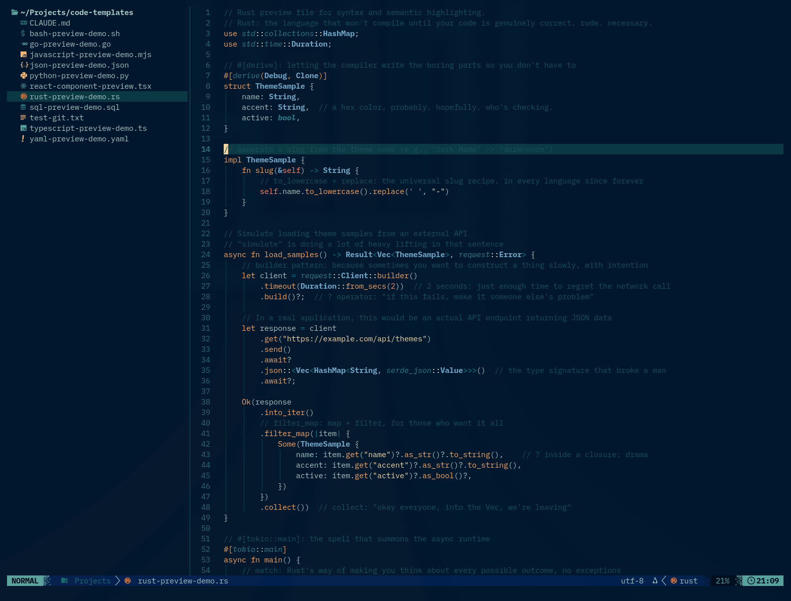

# Retro 82 (`retro-82.nvim`)



Retro 82 is a high-contrast Neovim colorscheme with a neon-coastline vibe: deep navy backgrounds, sea-glass cyans, and warm sunset accents.

It includes highlight groups for modern Neovim workflows, including Treesitter, LSP diagnostics, Telescope, Gitsigns, Lazy, WhichKey, and more.

```text
┏━┓┏━╸╺┳╸┏━┓┏━┓   ╻┏━┓┏━┓
┣┳┛┣╸  ┃ ┣┳┛┃ ┃    ┣━┫┏━┛
╹┗╸┗━╸ ╹ ╹┗╸┗━┛    ┗━┛┗━╸
```

Repo: https://github.com/oldjobobo/retro-82.nvim

Current version: `0.3.0`

## Highlights

- Lua-native colorscheme entrypoint with a Vim compatibility shim
- Base16-backed Retro 82 palette with readable semantic aliases
- Treesitter, LSP, and classic syntax aligned around shared semantic roles
- Coverage for modern Neovim workflows including Telescope, Blink/Cmp, Neo-tree, Mini, Snacks, Lazy, Neogit, and more
- Lua-specific semantic token handling so `lua_ls` does not flatten useful Treesitter distinctions
- Flat dark popup and diagnostic sign backgrounds that stay consistent with the base theme

## Naming

- Product name: `Retro 82`
- Plugin/repo slug: `retro-82.nvim`
- Colorscheme ID: `retro-82`

## Installation

### lazy.nvim

```lua
{
  "oldjobobo/retro-82.nvim",
  lazy = false,
  priority = 1000,
  opts = {
    transparent = false,
    terminal_colors = true,
  },
  config = function(_, opts)
    require("retro82").setup(opts)
    vim.cmd("colorscheme retro-82")
  end,
}
```

### vim-plug

```vim
Plug 'oldjobobo/retro-82.nvim'
colorscheme retro-82
```

### packer.nvim

```lua
use { "oldjobobo/retro-82.nvim" }
vim.cmd("colorscheme retro-82")
```

## Usage

Set the theme with:

```vim
:colorscheme retro-82
```

Lua setup is optional. If you do use it, keep it minimal:

```lua
require("retro82").setup({
  transparent = false,
  terminal_colors = true,
})
vim.cmd("colorscheme retro-82")
```

## Options

Supported setup options:

- `transparent = false`
- `terminal_colors = true`

When `transparent = true`, the theme removes the background from the main window, floats, sign column, and statuslines.

Example:

```lua
require("retro82").setup({
  transparent = true,
  terminal_colors = true,
})
```

## Recent Changes

The current release line includes:

- the Lua refactor from the original monolithic colorscheme file
- a semantic palette pass that makes fuller use of the Retro 82 Base16 palette
- Treesitter and LSP role alignment for parameters, members, modules, builtins, and diagnostics
- Lua-specific LSP fixes so semantic tokens do not override better Treesitter distinctions
- flatter popup and sign backgrounds for a more consistent dark surface treatment

## Verification

For a quick local regression check from the repo root:

```bash
XDG_CACHE_HOME=/tmp/retro82-cache XDG_STATE_HOME=/tmp/retro82-state \
  nvim --headless -u NONE -c 'luafile scripts/verify.lua'
```

## Versioning

`retro-82.nvim` uses Semantic Versioning.

- `MAJOR`: breaking visual or structural changes
- `MINOR`: new highlight coverage, integrations, and non-breaking theme improvements
- `PATCH`: fixes, small polish updates, and regressions

Release tags should use a `v` prefix, for example:

```text
v0.3.0
```

See [CHANGELOG.md](/home/oldjobobo/Projects/nvim-themes/retro-82.nvim/CHANGELOG.md) for release notes.

## Extras

Additional app ports are in `extras/`:

- `retro-82.Xresources` (Xresources/X11 terminals)
- `retro-82.itermcolors` (iTerm2)
- `retro-82.fish` (fish shell)
- `retro-82.zsh` (zsh)
- `retro-82.yml` (Alacritty YAML)
- `retro-82.toml` (Alacritty TOML)
- `retro-82.colorscheme` (QTerminal)
- `retro-82.ghostty` (Ghostty)

## Credits

The Neovim plugin structure and baseline theme implementation are based on [miasma.nvim](https://github.com/xero/miasma.nvim) by [xero](https://x-e.ro).

The Retro 82 color palette and color decisions are by OldJobobo.


## License


All files and scripts in this repo are released under [CC0](https://creativecommons.org/publicdomain/zero/1.0/) / [kopimi](https://kopimi.com).
