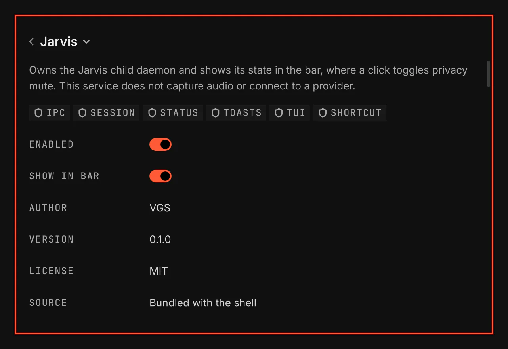

# Jarvis

Jarvis runs a service-owned Node child and shows its health in Settings. The child tracks session state and saves safety records on your computer. Jarvis stores provider keys in your desktop keyring and finds account login hints. It can verify an API or local account when you request it. The installed daemon has no speech or conversation engine and performs no desktop actions.

Screenshot made with `scripts/readme-shots.sh` in the nested sandbox, with the default theme at scale 2.

## Features

- The child ends when the service closes its stdin.
- Bounded restart reports a problem and shows a toast when recovery ends.
- The service reads the session lock without receiving lock authority.
- The child tracks session state without opening a microphone or a provider.
- Talk mode selects hold or toggle behavior for future engines.
- Mute persists across restarts and blocks talk input.
- A bar icon shows whether Jarvis is off, ready, listening, working, muted or has a problem.
- A click on the bar icon toggles mute, as the Mute key does.
- The child records refused action approvals and privacy cleanup.
- Settings opens Add key in a floating terminal with hidden key input.
- Settings shows whether a referenced key is present, absent, locked or unavailable without reading it.
- Settings and the launcher open local voice setup in a floating terminal.
- Local setup verifies downloaded models and runs a bundled test clip without opening audio devices.
- Accounts finds nested account directories and lets you add another directory.
- Accounts can remember a key another tool stored without copying its value.
- Login hints and local-server presence are not verified inference access.

## Requirements

The daemon needs Node 22 or later. Key storage needs libsecret's secret-tool and a desktop Secret Service. Key presence needs busctl. Terminal flows need gum. Local setup needs uv, curl, Python and user namespaces. Its locked wheels target Linux x86_64. A CUDA tier also needs working CUDA libraries. The core's requirement notice offers installation of declared missing commands.

The optional command sandbox needs bubblewrap and available user namespaces. This skeleton offers no shell tools.

## How it works

The service sends its current configuration and lock observation to the child. The child answers with its health and session state. Settings shows its health. Add key asks for a provider, an account label and the provider's origin, then hides key input. The desktop keyring stores the key. VGS stores only the item's reference. Disable destroys the service and its child.

## Settings

Talk mode defaults to Hold. Toggle keeps conversation demand open until the next press. No mode captures audio until an engine and its indicator are available.

Turn on Show in bar on the Jarvis page to put the Jarvis icon in the bar's right section. Its tooltip names the state and what a click does.

Audio uses half duplex. Jarvis closes its microphone while speech plays. Talk can interrupt speech, but spoken interruption during playback is unavailable. Echo cancellation has no supported setting. Jarvis changes no desktop audio defaults.

The Keys section changes Talk, Mute and Stop. Talk defaults to Super with Right Alt. Mute defaults to Super with Shift and Right Alt. Stop defaults to Super with Alt and Period. Mute is separate from Talk mode.

Open Jarvis in Settings and select Add key. Use the provider's origin, such as `https://api.openai.com`, without a path. Add key can ask the desktop keyring to unlock because you started storage. The background presence check never unlocks it.

Select Set up local voice in Settings or the launcher's Jarvis group. Choose a tier in the terminal. Setup downloads its models and a private runtime. Settings reports Ready only after file verification and the bundled probe succeed. This prepares local voice files; voice control is not active in this skeleton.

Brain account keeps the account you select. This skeleton does not start a brain. Settings retains a saved selection when discovery no longer offers it.

Select Accounts to add a directory, choose an existing keyring item by label or inspect login hints. Verify asks for a model and consent because a real inference request may cost money. API and local verification send one small request. Subscription and speech-only verification remain unavailable. A login hint never proves inference access.
