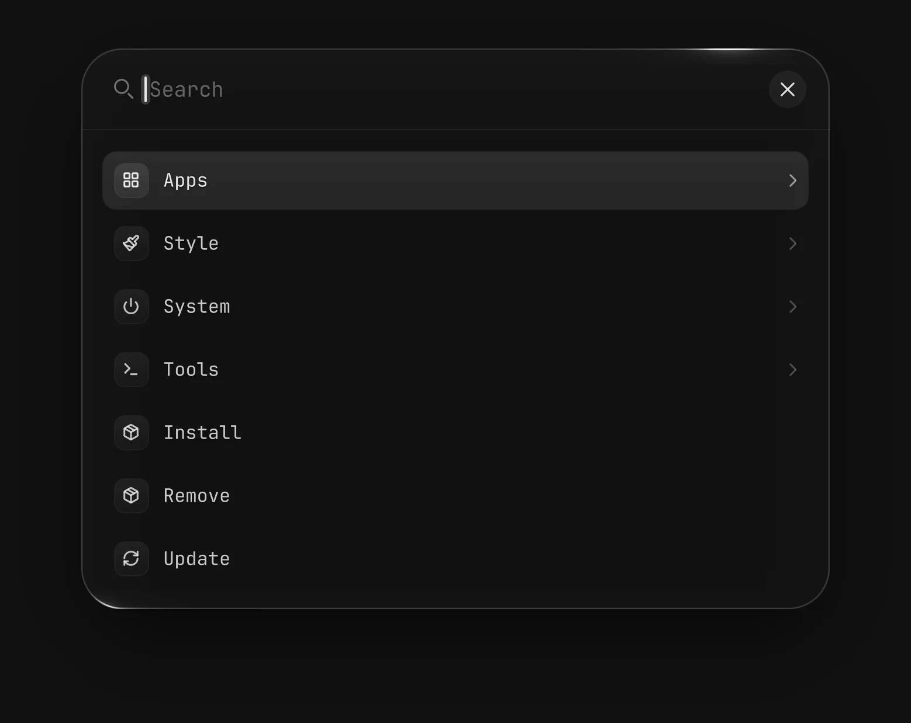

# Launcher

`vgs.launcher`: a Spotlight launcher. One glass search field opens over the screen; typing searches every menu row and installed application, `f:` searches files and `F:` folders, and Ctrl+B or the menu button shows the category tree. It is a port of the customised Spotlight launcher of the owner's Omarchy dotfiles, drawn and behaving as that one does, on this shell's plugin contract.



Screenshot made with `scripts/readme-shots.sh` in the nested sandbox, with the default theme at scale 2.

## Opening it

| Path | How |
|---|---|
| Shortcut | The service registers `vgs.launcher:toggle`, and the manifest binds it to `SUPER+SPACE` in the Hyprland layer the shell writes while the plugin is enabled ([hyprland.md](../../../docs/architecture/hyprland.md)). To change the key, edit it under Keys on the plugin's Settings page, or give the plugin's row in `~/.config/vgs/shell.json` a `keys` entry, `{ "id": "vgs.launcher", "keys": { "toggle": "SUPER+ALT+SPACE" } }`; `null` in place of the key unbinds it. |
| Bar entry | `vgsh plugin enable vgs.launcher` places the magnifier in the bar's left section. A left click toggles the launcher on that screen; a right click runs `xdg-terminal-exec`. |
| IPC | `vgsh ipc call vgs.launcher invoke toggle '<payload>'` or `... invoke summon '<payload>'`, or the host's own `vgsh ipc call shell summon overlay vgs.launcher '<payload>'`. |

A closed launcher holds no surface: the overlay host builds it on summon and destroys it on hide.

## Payload

A JSON object; an empty argument is `{}`. A key not listed, or a value of the wrong type, refuses the summon with `refused: open-failed=vgs.launcher` and the reason in the shell's log. `MenuModel.parsePayload` is the judge.

| Key | Meaning |
|---|---|
| `menu` | A route: a menu id such as `system`, or an alias a menu file declares, such as `power-menu`. A route naming an action runs it without opening. |
| `query` | Text to search for once open, such as `f:report`. |
| `mode` | `menu` (the default), `select` or `input`. |
| `prompt`, `options`, `width`, `maxHeight` | A picker's header, its rows, its card width and its tallest list, in pixels. An option is `label`, `glyph<TAB>label` or `glyph<TAB>label<TAB>detail`. |
| `selectionFile`, `doneFile` | Required for a picker: two different paths inside `$XDG_RUNTIME_DIR`. |

A picker answers once. A pick writes the label (and a tab and its detail, when it has one) to `selectionFile`, then `ok` to `doneFile`. Escape, a click outside, a hide, the next summon, a rebuild or a disable writes `cancel` to `doneFile` alone. A selection that could not be written makes `doneFile` say `error`. A caller waits for `doneFile`:

```bash
sel="$XDG_RUNTIME_DIR/pick.sel"; done="$XDG_RUNTIME_DIR/pick.done"
vgsh ipc call shell summon overlay vgs.launcher "{\"mode\":\"select\",\"prompt\":\"Pick\",\"options\":[\"one\",\"two\"],\"selectionFile\":\"$sel\",\"doneFile\":\"$done\"}"
until [[ -s $done ]]; do sleep 0.05; done
[[ $(<"$done") == ok ]] && cat "$sel"
```

## Menu

`menu.json` is the shipped menu. `~/.config/vgs/launcher/menu.json` merges over it by id and per key, so a user file can change one label without restating the row; the file is watched, and the launcher makes `~/.config/vgs/launcher/` when it opens, so a file first created there while it is open is read. Both are `{ "schemaVersion": 1, "items": { "<id>": { ... } } }`, and a dotted id names its parent. `MenuModel.ITEM_KEYS` lists the keys an item may set:

- `run`: an argument list the `run` capability starts, with no shell unless the list names one.
- `target`: a link to another menu. `provider`: `apps` for installed applications, `themes` for the theme packages.
- `requires`: commands the row needs; a missing one shows the row as unavailable, naming it.
- `unavailable`: why the shell cannot offer the row. It shows, and does nothing.
- `tui`: the key of a floating TUI `shell.tui.entries` lists, `core/<name>` or `<plugin id>/<name>` ([tui-capability.md § The capability](../../../docs/architecture/tui-capability.md#the-capability)). Picking the row opens it. The launcher closes on `ok`, which `open` also answers for a busy key after focusing its live window. Any other refusal stays in the list as a notice and is logged as `launcher: tui <key> <answer>`.
- `tuiGroup`: a group of that list. The row opens the first listed entry of the group, in the list's key order, so it opens another plugin's TUI without naming the plugin.
- `label`, `icon` (a Lucide name), `title`, `description`, `aliases`, `parent`.

A row states one of `run`, `target`, `provider`, `unavailable`, `tui` and `tuiGroup` at most. A `tui` or `tuiGroup` row whose TUI is not listed is hidden, as a disabled plugin's TUIs leave the list, and it shows again when a plugin that lists one is enabled while the launcher is open.

A file the judge refuses is logged as `launcher: menu refused: file=<path> <defect>` and shows as a notice row; the shipped menu stands.

Omarchy's own menu actions are not ported: they run Omarchy scripts. The shipped menu maps what a Hyprland session has everywhere (lock with `vgsh lock`, which asks `vgs.lock`, since a logind lock request reaches no listener in the shell: [lock-polkit.md](../../../docs/architecture/lock-polkit.md); suspend, hibernate, log out, reboot, shut down; a terminal, a screenshot, the theme packages). Delete on an application points at the Remove row instead of removing it: `shell.tui.open` opens the remove picker with no arguments, so the launcher cannot name the application's package.

Install opens `core/pkg-install` and Remove `core/pkg-remove`, the core's package pickers ([packages.md § Pickers](../../../docs/architecture/packages.md#pickers)). Update opens the first listed entry of the group `Update`, which an updates plugin declares for its pipeline, and is hidden while no enabled plugin declares one. Omarchy's Install › Package and Remove › Package rows are action strings, `xdg-terminal-exec --app-id=org.omarchy.terminal omarchy-pkg-install`, and Update › Omarchy runs `omarchy-launch-floating-terminal-with-presentation omarchy-update` (`default/omarchy/omarchy-menu.jsonc`, basecamp/omarchy `e332dc97`). VGS names an entry instead: the core builds the argv and the window from the TUI's declaration, so no menu text becomes shell code. The rows sit at the top level rather than one level down, since the shell has one installer, one remover and one update entry to offer. The Terminal row still runs `xdg-terminal-exec`.

## Files

`f:` and `F:` run `file-search.sh` from the plugin's published revision; its header states its protocol and every refusal. The index lives in `$XDG_CACHE_HOME/vgs/launcher/`, holds at most 200000 entries, and refreshes each time the launcher enters `f:` or `F:`. A query shows at most 40 results; hits with one name sit together, newest first. Enter opens the pick with its default application; Shift+Enter or a right click lists the applications that open it, with Show in folder and Copy path. A helper that fails shows its keyed line as a notice row. It needs `fd`, `fzf`, `file`, `flock`, `gio`, `xdg-mime` and `wl-copy`.

## Look

`Appearance.js` holds every value the launcher draws with, as the `appearance` table [docs/decisions/D023](../../../docs/decisions/D023-plugin-owned-appearance.md) sets out. The theme reaches it through `scheme.mode`, `palette.accent` and `motion.scale` alone, so a theme's palette, fonts and metrics leave the glass as it is; the accent lights the orbiting edge reflection and the caret while a search runs. The result list and the file flyout move their highlight through the list motion of `qs.Ui`, `ListCursor` and `ListEntrance`, at the launcher's own timings and curves and with its own glass plate ([motion.md](../../../docs/architecture/motion.md)). With the motion scale at 0 nothing animates, the caret stays on and the edge lights stand still.

Hyprland blurs what is behind the glass only when a layer rule asks it to, for the host's namespace `vgs:overlay`. The manifest declares that rule, and the Hyprland layer writes it as:

```lua
hl.layer_rule({ name = "vgs.launcher:overlay", match = { namespace = "^vgs:overlay$" }, blur = true, ignore_alpha = 0.6 })
```

`hyprland.lua` runs the layer from the line `vgsh hypr wire` keeps first in it, so your own settings after that line win. To change the rule, call `hl.layer_rule` with its name and new values after the line; `enabled = false` turns it off.

## Shader

The edge reflection is `shaders/edgelight.frag`, compiled to `shaders/edgelight.frag.qsb` beside it. After editing the source, compile it again from this directory with Qt 6's `qsb`:

```bash
/usr/lib/qt6/bin/qsb --glsl "100es,120,150" --hlsl 50 --msl 12 -o shaders/edgelight.frag.qsb shaders/edgelight.frag
```
