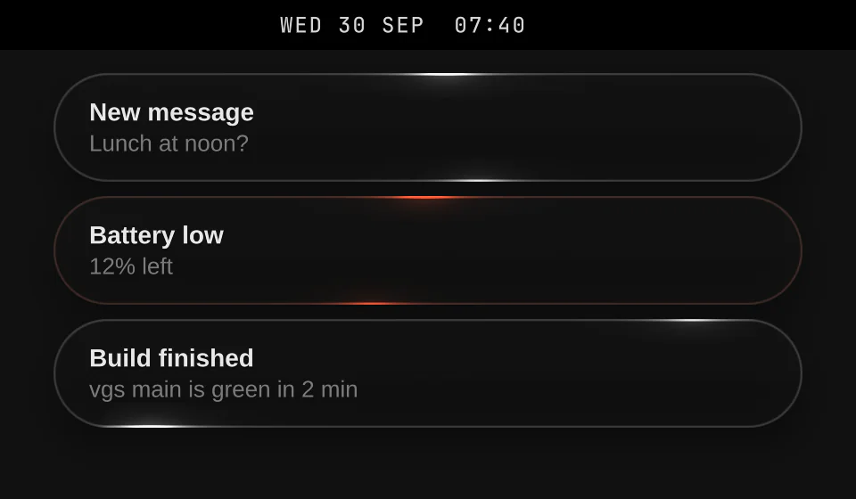
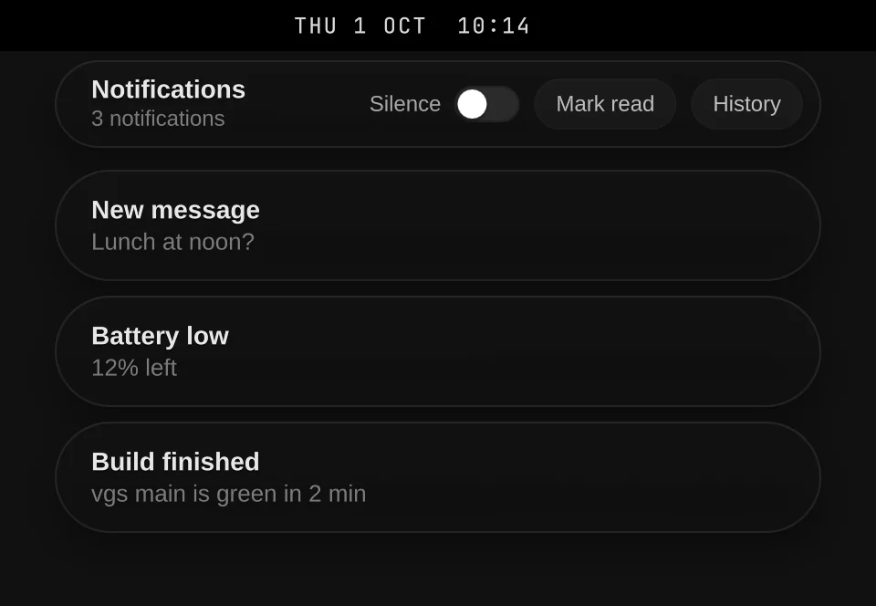

# Notifications

`vgs.notifications`: the desktop notification daemon. Every notification an application sends shows as a Spotlight glass capsule at the top of every screen, and leaves into the history when it expires, is dismissed, is acted on, is closed by its sender or is let go by a full stack. An Inbox lists what arrived since the last Mark read and a History everything kept; Silence keeps notifications off the screen and records them. It is a port of the customised Spotlight notifications of the owner's Omarchy dotfiles, drawn and behaving as that one does, on this shell's plugin contract.

The core's notification server takes the `org.freedesktop.Notifications` name while the plugin is enabled, so another notification daemon must not run beside it.





Screenshots made with `scripts/readme-shots.sh` in the nested sandbox, with the default theme at scale 2.

## Opening the panel

| Path | How |
|---|---|
| Shortcut | The service registers `vgs.notifications:inbox`, and the manifest binds it to `SUPER+N` in the Hyprland layer the shell writes while the plugin is enabled ([hyprland.md](../../../docs/architecture/hyprland.md)). To change the key, edit it under Keys on the plugin's Settings page, or give the plugin's row in `~/.config/vgs/shell.json` a `keys` entry, `{ "id": "vgs.notifications", "keys": { "inbox": "SUPER+SHIFT+N" } }`; `null` in place of the key unbinds it. |
| IPC | `vgsh ipc call vgs.notifications invoke <name> <arg>`, names below. |

While a panel is open the toasts stay and do not expire, a press outside the stack closes it, and the header holds Silence, Mark read (the Inbox) or Clear history (the History), and the switch between the two. Mark read marks everything so far read and closes the panel; Clear history removes the kept notifications and leaves the panel open. The panel takes no keyboard.

| IPC name | Argument | Reply |
|---|---|---|
| `inbox` | none | toggles the Inbox; `ok` |
| `history` | none | opens the History; `ok` |
| `close` | none | closes the panel; `ok` |
| `mark-read` | none | as the button; `ok` |
| `clear-history` | none | as the button; `ok` |
| `silence` | `on`, `off`, `toggle`, or empty to read it | `on` or `off`, or `refused: silence=<arg> want=on\|off\|toggle` |
| `dismiss-all` | none | dismisses every toast; `ok`, or `none` with none on screen |
| `dismiss-latest`, `invoke-latest` | none | dismisses, or clicks, the newest toast; `ok` or `none` |
| `status` | none | one JSON line: `silence`, `panel`, `store` (`state`, `problem`), `onScreen`, `history`, `held` (below), `readBefore`, `duplicates` (`keptDesktop`, `keptBrowser`, below) |

## Toasts

- A toast shows for at least `duration` seconds at normal urgency, 8 by default, and for the shorter of 5 seconds and `duration` at low urgency, longer when the sender's timeout asks, up to 30 seconds. Set `duration` from 2 to 30 on the plugin's Settings page, or as `{ "id": "vgs.notifications", "duration": 12 }` in `plugins` in `~/.config/vgs/shell.json`. A critical toast stays until it is closed. The pointer on a toast, or an open panel, pauses its clock.
- A sender replacing its notification updates the toast in place and starts its clock over; a sender closing it ends the toast.
- Hovering a card reveals its actions: the sender's own while its notification is still open (below), Show when it has none and one of its windows is open, and Dismiss. A click opens the notification, and a right click dismisses it.
- The body renders the markup the server advertises, less every image tag and a browser's leading site address ([notification-senders.md § Browser notifications](../../../docs/architecture/notification-senders.md#browser-notifications)). The summary is plain text.
- At most 20 toasts show at once; a newer one lets the oldest non-critical toast go into the history.
- Silence keeps every notification off the screen and records it in the history, bar a critical one from the bare command line (`notify-send -u critical`). A notification from the bare command line that is not critical, or one marked transient, is not recorded under Silence.

Omarchy's own hints, `omarchy-glyph` and `omarchy-exec-argv`, and its `omarchy-action` sender are not ported: nothing in this shell sends them.

## Opening a notification

A click on a toast or an inbox row, Show and `invoke-latest` open a notification, and a pill runs the sender's action it names, the same way for every application:

1. While the notification is still open, the action reaches the sender, which then shows what the action is about.
2. The sender's window comes into view, open or not: its workspace, a hidden special workspace, a background group tab or another monitor. With several windows, the one the sender asks for, else the one used last. The server gives the sender no activation token, so on Wayland the sender cannot raise its own window; when it does, nothing else moves.

Dismiss sends nothing and raises nothing. A toast that expires stays open for its inbox row until the row leaves the history, the user dismisses it or clears the history, or the sender closes it; `held` in `status` counts these. A Slack message from a browser raises that browser. Slack's notifications carry no link to their channel or message, so a Slack row no longer open raises Slack alone. Unlike Omarchy's, an inbox row opens too: [notification-actions.md](../../../docs/architecture/notification-actions.md).

Any sender can add the VGS hints, a Lucide icon, a status tone and a file a click opens in your `$EDITOR`: [notification-hints.md](../../../docs/architecture/notification-hints.md).

## Slack

A per-application rule reads Slack's notifications: their senders as faces, their workspace as its icon, one card per message, optional sender photos from a token per workspace, and each workspace's custom emoji in the body. [slack.md](slack.md) holds what each shows, how to store a token and how to turn the custom emoji off.

The Slack features run commands the plugin declares as optional requirements. The plugin's Settings page lists each one under Requirements, whether it is installed and what it is for, with an Install button while one is missing. Toasts, the panel and Silence need none of them.

## State

Where the notifications keep their state, what a restart restores and how a bad file is treated: [notification-state.md](../../../docs/architecture/notification-state.md).

## Look

`Appearance.js` holds every value the notifications draw with, as the `appearance` table [docs/decisions/D023](../../../docs/decisions/D023-plugin-owned-appearance.md) sets out. The theme reaches it through `scheme.mode`, `palette.accent` and `motion.scale` alone, so a theme's palette, fonts and metrics leave the glass as it is. The accent lights the edge reflection of a critical toast and the Silence switch. With the motion scale at 0 nothing animates and the edge lights stand still.

The glass, the edge light, the pills and the switch are the plugin's own files, drawn from its own table: a plugin imports no other plugin's files.

Where a card's text and media sit, and how the media slot's tier is chosen: [notification-layout.md](../../../docs/architecture/notification-layout.md).

The stack draws on the core's passive layer, `vgs:layer` ([docs/architecture/layers.md](../../../docs/architecture/layers.md)). Hyprland blurs what is behind the glass only when a layer rule asks it to. The manifest declares that rule, and the Hyprland layer writes it as:

```lua
hl.layer_rule({ name = "vgs.notifications:layer", match = { namespace = "^vgs:layer$" }, blur = true, ignore_alpha = 0.6 })
```

`hyprland.lua` runs the layer from the line `vgsh hypr wire` keeps first in it, so your own settings after that line win. To change the rule, call `hl.layer_rule` with its name and new values after the line; `enabled = false` turns it off.

## Shader

The edge reflection is `shaders/edgelight.frag`, compiled to `shaders/edgelight.frag.qsb` beside it. After editing the source, compile it again from this directory with Qt 6's `qsb`:

```bash
/usr/lib/qt6/bin/qsb --glsl "100es,120,150" --hlsl 50 --msl 12 -o shaders/edgelight.frag.qsb shaders/edgelight.frag
```
