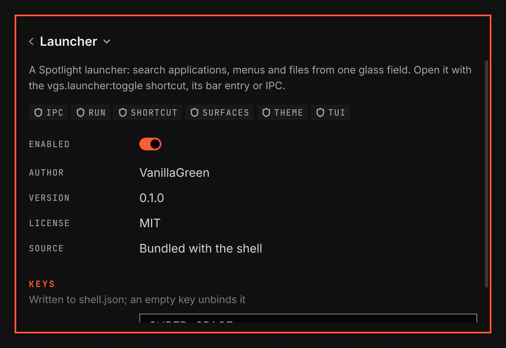

# Settings

`vgs.settings`: the window that lists every plugin the shell found and opens a page for each, with its details, its settings and its keys. It lists itself, so it can be disabled, rebound and opened at one plugin's page like any other plugin.

Screenshot made with `scripts/readme-shots.sh` in the nested sandbox, with the default theme at scale 2.

## Opening it

| Path | How |
|---|---|
| Shortcut | `SUPER+M` opens and closes it on the focused monitor. The service registers `vgs.settings:toggle`, and the manifest binds it in the Hyprland layer the shell writes. Change the key under Keys on the plugin's own page. |
| Bar | The gear in the bar's right section, where the shipped layout places it. A click opens and closes the window on that bar's monitor, which the click focuses. |
| IPC | `vgsh ipc call vgs.settings invoke toggle '<payload>'` or `... invoke open '<payload>'`, or the host's `vgsh ipc call shell summon window vgs.settings '<payload>'`. |

The payload is `{}` for the list, or `{"plugin":"<id>"}` for that plugin's page. An id no plugin has opens the list with a notice naming it. Any other key refuses the summon with `refused: open-failed=vgs.settings`. A script, a key or a launcher menu entry opens a page through `vgsh ipc call shell summon window vgs.settings '{"plugin":"<id>"}'`. Another plugin cannot open it through its `surfaces` capability, which opens only that plugin's own surfaces.

## The window

- A Hyprland window titled Settings, of class `org.vgs.shell`. It opens floating and centred, 600 pixels wide, or the monitor's width less a margin a side on a narrower one, and half the monitor's height tall, and takes the keyboard. Hyprland draws its border and moves, resizes, tiles and closes it like any other window: click another window to type there, and use your own keys to move it or tile it. To tile it by default, add `hl.window_rule({ name = "vgs:window", enabled = false })` to `hyprland.lua` after the line that loads the VGS layer.
- The list: an Add plugin button, a search field and one row per plugin with its icon, name, version, `Bundled` or `Installed`, a red badge counting its errors, its switch and a chevron. Up and Down in the search field move the highlighted row; Enter or a click opens its page.
- A plugin's page: a back button and the plugin's name as a title. A click on the title opens a menu of every plugin, the current one checked, that jumps to another plugin's page; typing letters there jumps to the plugin whose name starts with them.
- The page shows the description, the capabilities, each error, the switch, the author, version, licence and source, and for an installed plugin its Update and Remove buttons.
- Requirements: one row per command the plugin runs, Present or Missing as the last scan found it, with what the plugin uses it for. While one is missing, Install shows the shell's requirement notice, which names the packages and installs them.
- Status: what the plugin reports about itself, such as whether a token is stored, one row per entry of its manifest's `status`. A row whose step is needed shows its button, such as Enable while logged out, which opens a floating terminal or the shell's install notice. A token row shows Connect, which opens a masked field whose Save stores the token in your keyring, and Disconnect once one is stored. Show command reveals the command a step runs, with a Copy button. A disabled plugin's rows read Not reported.
- Settings: one field per entry of the plugin's `schema`, grouped under the entry's `group`. A number with a `min` and a `max` is a slider.
- Keys: one row per key the plugin's manifest binds. Type a key such as `SUPER+SHIFT+M`, empty the field or press the cross to unbind it, and press the arrow to go back to the manifest's key. The key is written to the plugin's `keys` in `~/.config/vgs/shell.json`.
- A disabled plugin's fields are read-only until it is enabled again.
- Escape goes back to the list, then closes the window. Your close key closes it too.

Add plugin, Update and Remove each open a floating terminal that runs the matching `vgsh plugin` command there: Add plugin asks for the plugin's git URL, Update shows the incoming changes and asks before it applies them, and Remove asks before it deletes. The same commands work in any terminal. The window stays open behind the terminal or the notice, and shows the result once the command ends.

## Turning it off

Its own switch removes the window, the gear and the shortcut. No window is then left to turn it back on, so its page keeps the command that does behind Show command; that command also places the gear in the right section when your `shell.json` has a `bar` key of its own.
