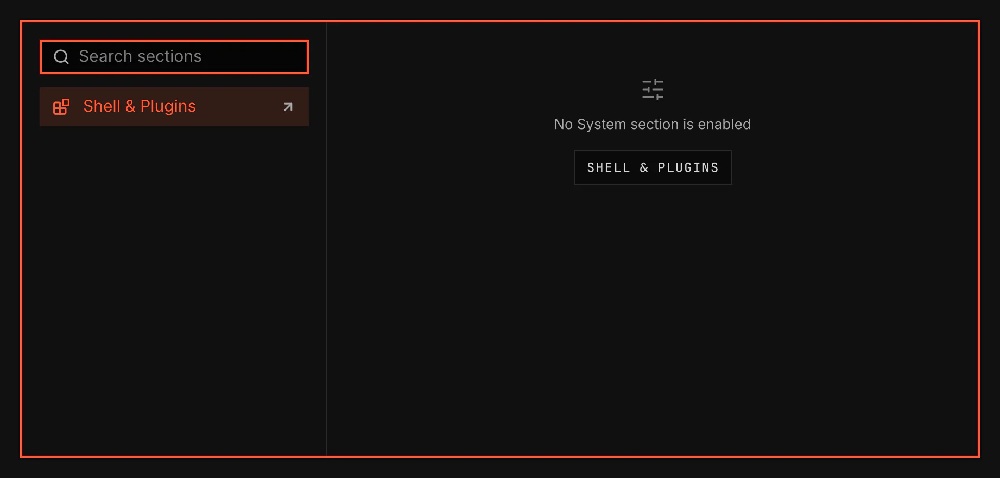

# System

`vgs.system`: one window for every System section, such as sound, displays and network. A sidebar lists the enabled sections under their groups, and the chosen section fills the page beside it. Each section is its own plugin of kind `pane`, which you enable and disable in Settings like any plugin; this window lists and shows them.

Screenshot made with `scripts/readme-shots.sh` in the nested sandbox, with the default theme at scale 2. No section plugin ships yet, so the window shows its empty state.

## Opening it

| How | What it opens |
|---|---|
| `SUPER+COMMA` | The section shown last, or the first. The same key closes the window. Settings' Keys row rebinds it. |
| A section's own Settings link | That section. |
| IPC | `vgsh ipc call vgs.system invoke toggle '<payload>'` or `... invoke open '<payload>'`, or the host's `vgsh ipc call shell summon window vgs.system '<payload>'`. |

The payload is `{}` for the section shown last, or `{"pane":"<id>"}` for that section; any other keys beside `pane` go to the section. An id no enabled section has opens the window with a notice naming it. The window remembers the last section while the shell runs.

## The window

- A Hyprland window titled System, of class `org.vgs.shell`. It opens floating and centred and takes the keyboard. Hyprland draws its border and moves, resizes, tiles and closes it like any other window.
- The sidebar holds a search field, the enabled sections under their group headings, and Shell & Plugins at the foot, which opens the Settings window to enable, disable and configure plugins.
- The page shows the section's icon and name, and Show in bar for a section with a bar widget: it puts the widget in the bar or takes it out, and leaves the section enabled. A section taller than the window scrolls.
- Only the shown section is built. Choosing another destroys the one before it, and closing the window destroys both.

## Keys

- Up, Down, Home, End, Page Up and Page Down move the selection in the sidebar. A letter selects the next section whose name starts with it.
- Enter or Right opens the selected section and moves the keyboard into it. Enter on Shell & Plugins opens Settings.
- Escape in a section returns to the sidebar. Escape in the sidebar closes the window.
- Ctrl+F moves to the search field. There, typing filters the sections, Up, Down and Enter still move and open, and Escape clears the search, then returns to the sidebar.

## Validation

`scripts/smoke/rows/system-window.sh` runs it in the nested sandbox over copies of a fixture section: the sidebar lists exactly the enabled sections in their groups and follows a section disabled while it is open, a deep link and a section's own link open their section, switching destroys the section before it, Show in bar places and removes the fixture's widget, a tall section scrolls, the window's edges line up within one pixel, it behaves as a Hyprland window, and the keyboard alone opens, moves, enters, leaves, searches and closes it. [docs/architecture/system-window.md](../../../docs/architecture/system-window.md) holds the contract.
